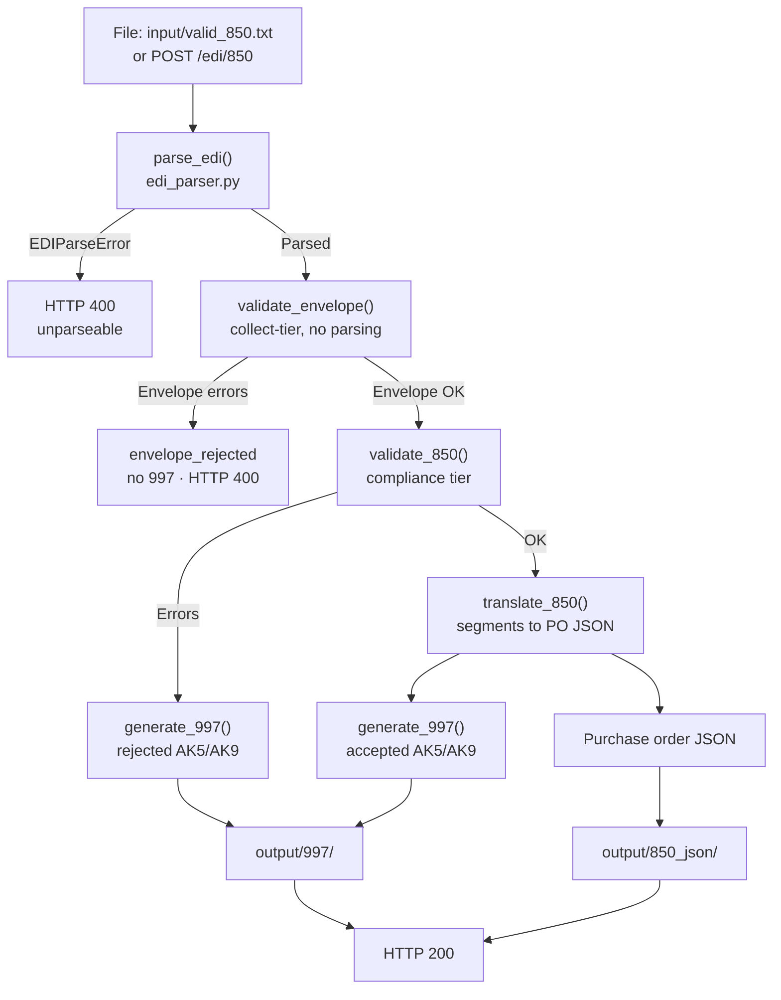

# edi-integration-pipeline

**X12 EDI parsing, validation, translation and acknowledgment generation in
plain Python — no third-party EDI library.** Two production-shaped workflows,
exposed identically as a CLI and as a FastAPI service.

| | |
|---|---|
| **Inbound** | X12 850 Purchase Order → envelope gate → compliance validation → purchase-order JSON → 997 acknowledgment |
| **Outbound** | Invoice JSON → validation → X12 810 Invoice → round-trip validation of the generated EDI |

Parsing, validation, X12 generation and delimiter handling are implemented
directly against the 004010 standard. Both entry points call the **same
functions** — there is exactly one copy of the EDI logic, and the only
difference between a file run and an HTTP request is where the bytes came
from.

Built by an integration engineer with 18 years in production EDI/B2B
(IBM Sterling, WebSphere Transformation Extender). The design decisions
below are the interesting part of this repo — they are the ones that come
from having watched these pipelines fail in production.

---

## Quickstart

```bash
git clone https://github.com/<your-username>/edi-integration-pipeline.git
cd edi-integration-pipeline
python3 -m venv .venv && source .venv/bin/activate
pip install -r requirements.txt
python src/main.py          # runs all four sample files with a full trace
```

Or run it as a service:

```bash
uvicorn main:app --app-dir src --reload
curl -X POST http://127.0.0.1:8000/edi/850 \
  -H "Content-Type: text/plain" --data-binary @input/valid_850.txt
```

Interactive API docs at `http://127.0.0.1:8000/docs`. Tests: `pytest`.

---

## See it work

### Inbound — 850 in

```
ISA*00*          *00*          *ZZ*NORTHWINDRTL   *ZZ*CASCADESUPPLY  *260817*1030*U*00401*000000101*0*P*>~
GS*PO*NORTHWINDRTL*CASCADESUPPLY*20260817*1030*101*X*004010~
ST*850*0001~
BEG*00*SA*PO10001**20260817~
REF*DP*STORE42~
N1*BY*NORTHWIND RETAIL LLC*92*BUYER001~
N1*SE*CASCADE SUPPLY CO*92*SELLER001~
PO1*1*10*EA*12.50**BP*WIDGET-100~
PO1*2*5*CA*45.00**BP*GADGET-200~
CTT*2~
SE*9*0001~
GE*1*101~
IEA*1*000000101~
```

### Purchase-order JSON out

```json
{
  "purchase_order_number": "PO10001",
  "purchase_order_date": "20260817",
  "purpose_code": "00",
  "order_type_code": "SA",
  "control_numbers": {
    "interchange_control_number": "000000101",
    "group_control_number": "101",
    "transaction_control_number": "0001"
  },
  "buyer":  { "name": "NORTHWIND RETAIL LLC", "id": "BUYER001" },
  "seller": { "name": "CASCADE SUPPLY CO",    "id": "SELLER001" },
  "references": [ { "qualifier": "DP", "value": "STORE42" } ],
  "line_items": [
    { "line_number": "1", "quantity": "10", "unit_of_measure": "EA",
      "unit_price": "12.50", "product_id_qualifier": "BP",
      "product_id": "WIDGET-100", "extended_amount": 125.0 },
    { "line_number": "2", "quantity": "5", "unit_of_measure": "CA",
      "unit_price": "45.00", "product_id_qualifier": "BP",
      "product_id": "GADGET-200", "extended_amount": 225.0 }
  ],
  "line_item_count": 2
}
```

### 997 acknowledgment out — and delimiter fidelity

The 997 below was generated from a variant of the same interchange that uses
`+` as its element separator instead of `*`. The acknowledgment comes back in
the sender's own delimiters, not the library's defaults — delimiters are
detected from the inbound ISA and threaded through every generated segment.
Output is a single unterminated stream with no embedded newlines, because
some trading-partner platforms reject them.

```
ISA+00+          +00+          +ZZ+CASCADESUPPLY  +ZZ+NORTHWINDRTL   +260825+1253+U+00401+000000101+0+P+>~GS+FA+CASCADESUPPLY+NORTHWINDRTL+20260825+1253+101+X+004010~ST+997+0001~AK1+PO+101~AK2+850+0001~AK5+A~AK9+A+1+1+1~SE+6+0001~GE+1+101~IEA+1+000000101~
```

Submitting `input/invalid_850.txt` — missing BEG03/BEG05 and a non-numeric
PO102 quantity — produces a negative acknowledgment for the same interchange:
`AK5*R*5` and `AK9*R*1*1*0`, with the transaction rejected and no JSON written.

### Outbound — invoice JSON in, X12 810 out

```
ISA*00*          *00*          *ZZ*SELLER001      *ZZ*BUYER001       *260825*1301*U*00401*000010001*0*P*>~GS*IN*SELLER001*BUYER001*20260825*1301*10001*X*004010~ST*810*0001~BIG*20260817*INV10001**PO10001~REF*IV*INV10001~N1*BY*NORTHWIND RETAIL LLC*92*BUYER001~N1*SE*CASCADE SUPPLY CO*92*SELLER001~IT1*1*10*EA*12.50**BP*WIDGET-100~IT1*2*5*CA*45.00**BP*GADGET-200~TDS*35000~CTT*2~SE*10*0001~GE*1*10001~IEA*1*000010001~
```

`TDS*35000` is the invoice total in cents (350.00), computed from the line
items. `SE*10` and `CTT*2` are recomputed from what was actually built, then
verified by re-parsing the generated interchange before it is written.

---

## Design decisions

### Envelope integrity is a separate gate, ahead of transaction validation

Real EDI platforms treat ISA/GS/GE/IEA structure, delimiter detection and
control-number matching as a distinct tier that runs *before* any
transaction-specific check, because a broken envelope means segment
boundaries themselves cannot be trusted. This project mirrors that split:

- **`edi_parser.py`** owns parsing outright, including `check_isa()`, which
  raises `EDIParseError` on an interchange too malformed to split into
  segments at all. This is the halt tier — nothing downstream ever sees a
  file that fails here.
- **`validate_envelope.py`** takes the already-parsed segment list and
  *collects* structural errors — missing GS/GE/IEA, invalid GS04 date,
  mismatched control numbers, wrong group and transaction counts. It does
  not parse and does not raise.

### An envelope failure produces no 997

A 997 draws its own control numbers from the interchange it is acknowledging.
If the envelope is unreliable, those numbers are unreliable, and emitting an
acknowledgment built from them is worse than emitting nothing. Envelope-tier
failures short-circuit the pipeline with a distinct `envelope_rejected`
status and are surfaced to monitoring rather than acknowledged to the partner.

### Business rejection is HTTP 200, not 400

This is the distinction most EDI-over-HTTP implementations get wrong.

| Condition | HTTP | Why |
|---|---|---|
| Unparseable interchange | **400** | The request itself is malformed |
| Envelope rejected | **400** | Structurally invalid, and there is no safe 997 to return |
| Transaction fails compliance | **200** | The API call succeeded — it correctly reports an EDI business outcome, recorded in AK5/AK9 |
| Transaction accepted | **200** | — |

A correctly-formed 850 that fails business validation is a *successful*
integration event. Returning 400 for it conflates transport failure with
business outcome, and downstream retry logic will hammer a document that will
never pass.

### Validation runs before translation

`validate_850()` operates on the tokenized segment list, not on translated
JSON. A transaction that fails compliance goes straight to a negative 997
without ever needing a JSON representation, so building it earlier is wasted
work on the reject path.

### GS04 gets a calendar-validity check

Not standard compliance checking — a deliberate gap-fill. Sterling fails a
malformed GS04 date silently, with no 997 and no alert, which turns a
five-minute data problem into a multi-day trading-partner investigation. This
pipeline catches it at the envelope gate.

---

## Inbound flow



The outbound 810 flow and the full per-file breakdown are in
[`docs/ARCHITECTURE.md`](docs/ARCHITECTURE.md).

---

## Project structure

```
src/
├── main.py                  FastAPI app, both pipelines, file-based examples
├── edi_parser.py            delimiter detection, segment/element splitting,
│                             segment construction, file I/O
├── edi_exceptions.py        EDIParseError
├── validate_envelope.py     envelope structural gate (ISA/GS/GE/IEA)
├── validation/
│   ├── validation_shared.py shared numeric/presence primitives
│   ├── validate_850.py      compliance checks for inbound 850
│   └── validate_810.py      invoice JSON checks + generated-810 round trip
├── translation/
│   ├── translate_850.py     850 segments -> purchase order JSON
│   └── translate_810.py     invoice JSON -> 810 segments
└── edi_997.py               generate_997()

input/    sample inbound files (valid and invalid, 850 and invoice)
output/   generated 997s, purchase-order JSON, generated 810s
tests/    pytest suite
```

## Scope

**In scope and working:** envelope validation, 850 compliance validation,
850→JSON translation, 997 generation (transaction-level accept/reject),
invoice→810 generation with round-trip validation, delimiter fidelity across
non-default separators, and identical behaviour through both entry points.

**Deliberately out of scope for v1:** business-rule validation for the 850
(price tolerance, vendor allowlists), AK3/AK4 segment-level detail in the
997, and a persistence layer. Open items are tracked as
[issues](../../issues).

**Next:** landing translated transaction data in a warehouse and modelling it
with dbt — the analytics half of the same pipeline.

---

## Where to start reading

`src/main.py`, specifically `process_850()`. It names every other function in
the project in the order they run.
