# Simple EDI Pipeline — Version 1

A small, deliberately plain Python project that demonstrates two EDI workflows:

1. **Inbound X12 850** → parse → validate → generate 997 → convert to JSON
2. **Outbound invoice JSON** → validate → generate X12 810 → validate the generated EDI

Everything runs two ways — from files and from a FastAPI endpoint — using the
**same functions**. There is only one copy of the EDI logic.

The code uses only functions, dictionaries, lists, strings, loops and
conditionals. No classes, no dataclasses, no database, no third-party EDI
library. Readability is the point.

---

## Flow diagram

Both workflows can start from a file or from an API request, but from
`process_850()` / `process_invoice()` onward it is the exact same Python
functions either way — that reuse is the whole point of the design.

```mermaid
flowchart TD
    subgraph IN850["Inbound 850"]
        A1["input/valid_850.txt"] --> A3
        A2["POST /edi/850"] --> A3
        A3["process_850() — main.py"] --> A4["parse_edi() — edi_parser.py"]
        A4 --> A5["validate_850() — validation.py"]
        A5 --> A6["generate_997() — edi_997.py"]
        A6 --> A7{"valid?"}
        A7 -->|yes| A8["convert_850_to_json() — edi_parser.py"]
        A7 -->|no| A9["errors only, no JSON"]
        A8 --> A10["save_850_output() — main.py"]
        A9 --> A10
        A10 --> A11["output/997/*.txt"]
        A10 --> A12["output/850_json/*.json"]
    end

    subgraph OUT810["Outbound Invoice"]
        B1["input/valid_invoice.json"] --> B3
        B2["POST /invoice/810"] --> B3
        B3["process_invoice() — main.py"] --> B4["validate_invoice() — validation.py"]
        B4 --> B5{"valid?"}
        B5 -->|no| B9["errors only, no EDI"]
        B5 -->|yes| B6["generate_810() — edi_810.py"]
        B6 --> B7["validate_generated_810() — validation.py"]
        B7 --> B8["save_810_output() — main.py"]
        B8 --> B10["output/810/*.txt"]
    end
```



---

## Project structure

```
simple-edi-pipeline/
├── src/
│   ├── main.py          FastAPI app + file-based examples + the two pipelines
│   ├── edi_parser.py    file reading/writing, splitting X12, 850 -> JSON
│   ├── validation.py    validate_850(), validate_invoice(), validate_generated_810()
│   ├── edi_997.py       generate_997()
│   └── edi_810.py       generate_810() and the invoice total math
├── input/               sample inbound files
├── output/
│   ├── 997/             generated X12 997 acknowledgments
│   ├── 850_json/        JSON produced from inbound 850s
│   └── 810/             generated X12 810 invoices
├── tests/test_edi.py    pytest suite
├── requirements.txt
├── .gitignore
└── README.md
```

### What each Python file does

| File | Contents |
|---|---|
| `src/edi_parser.py` | `read_text_file()`, `write_text_file()`, `read_json_file()`, `write_json_file()`, `split_edi_segments()`, `parse_edi()`, `get_segment()`, `get_segments()`, `get_element()`, `build_segment()`, `convert_850_to_json()` |
| `src/validation.py` | `validate_850()`, `validate_invoice()`, `validate_generated_810()`. Each returns a **list of readable error strings**; an empty list means valid. |
| `src/edi_997.py` | `generate_997()` — builds ISA/GS/ST/AK1/AK2/AK5/AK9/SE/GE/IEA, accepted or rejected. |
| `src/edi_810.py` | `generate_810()`, `calculate_invoice_total()`, `calculate_line_amount()`, `make_control_number()`. |
| `src/main.py` | `process_850()`, `save_850_output()`, `process_invoice()`, `save_810_output()`, the three API endpoints, and `run_file_examples()`. |

### What `input/` contains

| File | Purpose |
|---|---|
| `valid_850.txt` | One buyer, one seller, two PO1 lines. Passes validation. |
| `invalid_850.txt` | BEG has no PO number and no PO date, and the PO1 quantity is `ABC`. Fails three ways. |
| `valid_invoice.json` | Two line items totalling 350.00. Passes validation. |
| `invalid_invoice.json` | No `invoice_number`, no `seller`, quantity `ABC`, blank `product_id`, negative price. Fails five ways. |

### What `output/` contains

| Folder | Written by | Example filename |
|---|---|---|
| `output/997/` | `save_850_output()` | `PO10001_997.txt`, `REJECTED_997.txt` |
| `output/850_json/` | `save_850_output()` (accepted only) | `PO10001.json` |
| `output/810/` | `save_810_output()` | `INV10001_810.txt` |

---

## Setup on macOS

Create the virtual environment (once):

```bash
cd /Users/aperalta/python-projects/simple-edi-pipeline && python3 -m venv .venv
```

Activate it (every new terminal session):

```bash
cd /Users/aperalta/python-projects/simple-edi-pipeline && source .venv/bin/activate
```

Your prompt now starts with `(.venv)`. Install the dependencies:

```bash
pip install -r requirements.txt
```

Leave the virtual environment later with `deactivate`.

---

## Run the file-based examples

This processes all four sample files and prints a full trace:

```bash
python src/main.py
```

## Start the API

```bash
uvicorn main:app --app-dir src --reload
```

`--app-dir src` puts `src/` on Python's import path, so `import edi_parser`
inside `main.py` works. `--reload` restarts the server when you edit a file.

Then open the interactive Swagger documentation in a browser:

```
http://127.0.0.1:8000/docs
```

Health check:

```bash
curl http://127.0.0.1:8000/health
```

Expected: `{"status":"ok"}`

## Submit the sample 850

From a second terminal, in the project folder:

```bash
curl -X POST http://127.0.0.1:8000/edi/850 -H "Content-Type: text/plain" --data-binary @input/valid_850.txt
```

The response contains `validation_status`, `validation_errors`,
`purchase_order`, `acknowledgment_997` and `saved_files`. Try the invalid one
to see the error messages:

```bash
curl -X POST http://127.0.0.1:8000/edi/850 -H "Content-Type: text/plain" --data-binary @input/invalid_850.txt
```

## Submit the invoice JSON

```bash
curl -X POST http://127.0.0.1:8000/invoice/810 -H "Content-Type: application/json" --data-binary @input/valid_invoice.json
```

```bash
curl -X POST http://127.0.0.1:8000/invoice/810 -H "Content-Type: application/json" --data-binary @input/invalid_invoice.json
```

## Inspect the generated files

```bash
find output -type f
```

```bash
cat output/997/PO10001_997.txt
```

```bash
cat output/850_json/PO10001.json
```

```bash
cat output/810/INV10001_810.txt
```

## Run the tests

```bash
pytest
```

Expected: `15 passed`.

---

## Expected output

**Valid 850** — accepted, PO10001, two line items, and this 997:

```
ISA*00*          *00*          *ZZ*CASCADESUPPLY  *ZZ*NORTHWINDRTL   *260817*1030*U*00401*000000101*0*P*>~
GS*FA*CASCADESUPPLY*NORTHWINDRTL*20260817*1030*101*X*004010~
ST*997*0001~
AK1*PO*101~
AK2*850*0001~
AK5*A~
AK9*A*1*1*1~
SE*6*0001~
GE*1*101~
IEA*1*000000101~
```

Note where the control numbers come from: `AK1*PO*101` repeats the inbound
GS06, and `AK2*850*0001` repeats the inbound ST02. Sender and receiver are
swapped in the ISA because the acknowledgment travels back the other way.

**Invalid 850** — rejected, `AK5*R*5` / `AK9*R*1*1*0`, and:

```
Purchase order number is missing (BEG03)
Purchase order date is missing (BEG05)
PO1 line 1: quantity 'ABC' is not a valid positive number
```

**Valid invoice** — accepted, total 350.00 sent as `TDS*35000`:

```
ISA*00*          *00*          *ZZ*SELLER001      *ZZ*BUYER001       *260817*1030*U*00401*000010001*0*P*>~
GS*IN*SELLER001*BUYER001*20260817*1030*10001*X*004010~
ST*810*0001~
BIG*20260817*INV10001**PO10001~
REF*IV*INV10001~
N1*BY*NORTHWIND RETAIL LLC*92*BUYER001~
N1*SE*CASCADE SUPPLY CO*92*SELLER001~
IT1*1*10*EA*12.50**BP*WIDGET-100~
IT1*2*5*CA*45.00**BP*GADGET-200~
TDS*35000~
CTT*2~
SE*10*0001~
GE*1*10001~
IEA*1*000010001~
```

**Invalid invoice** — rejected:

```
Invoice field is missing or empty: invoice_number
Invoice is missing the seller section
Line item 1: quantity 'ABC' is not a valid positive number
Line item 2: product/SKU identifier is missing
Line item 2: unit price '-45.00' is not a valid positive number
```

---

## How an 850 moves through the Python functions

```
input/valid_850.txt              POST /edi/850
        |                              |
   read_text_file()              post_850()  (main.py)
        |                              |
        +--------------+---------------+
                       |
                process_850(edi_text)          <- main.py, read this top to bottom
                       |
                parse_edi()                    <- edi_parser.py
                       |     text -> list of segments, each a list of elements
                validate_850()                 <- validation.py
                       |     returns [] or a list of readable error strings
                generate_997()                 <- edi_997.py
                       |     uses the inbound ISA / GS06 / ST02
                convert_850_to_json()          <- edi_parser.py (only if valid)
                       |
                save_850_output()              <- main.py
                       |
        output/997/PO10001_997.txt
        output/850_json/PO10001.json
```

The API endpoint and the file example call exactly the same `process_850()`.
The only difference is where the EDI text came from.

## How an invoice moves through the Python functions

```
input/valid_invoice.json         POST /invoice/810
        |                              |
   read_json_file()              post_810()  (main.py)
        |                              |
        +--------------+---------------+
                       |
             process_invoice(invoice)          <- main.py
                       |
                validate_invoice()             <- validation.py
                       |
                generate_810()                 <- edi_810.py
                       |     BIG, REF, N1 x2, IT1 per line,
                       |     TDS from calculate_invoice_total(),
                       |     CTT, then the SE segment count
                validate_generated_810()       <- validation.py
                       |     re-parses the EDI it just built and
                       |     checks SE01 and CTT01 add up
                save_810_output()              <- main.py
                       |
        output/810/INV10001_810.txt
```

---

## Where to start reading

Start with **`src/main.py`**, specifically `process_850()`. It is nine lines of
real work and names every other function in the project in the order they run.
From there follow each call into `edi_parser.py`, `validation.py`, `edi_997.py`
and `edi_810.py`.
