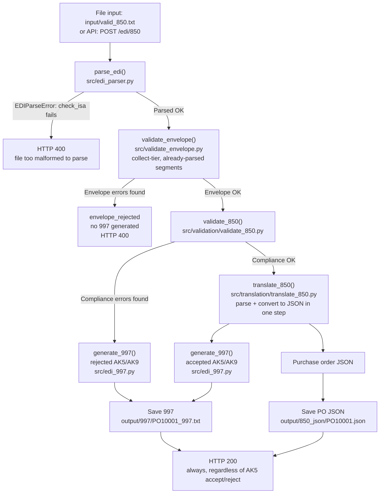
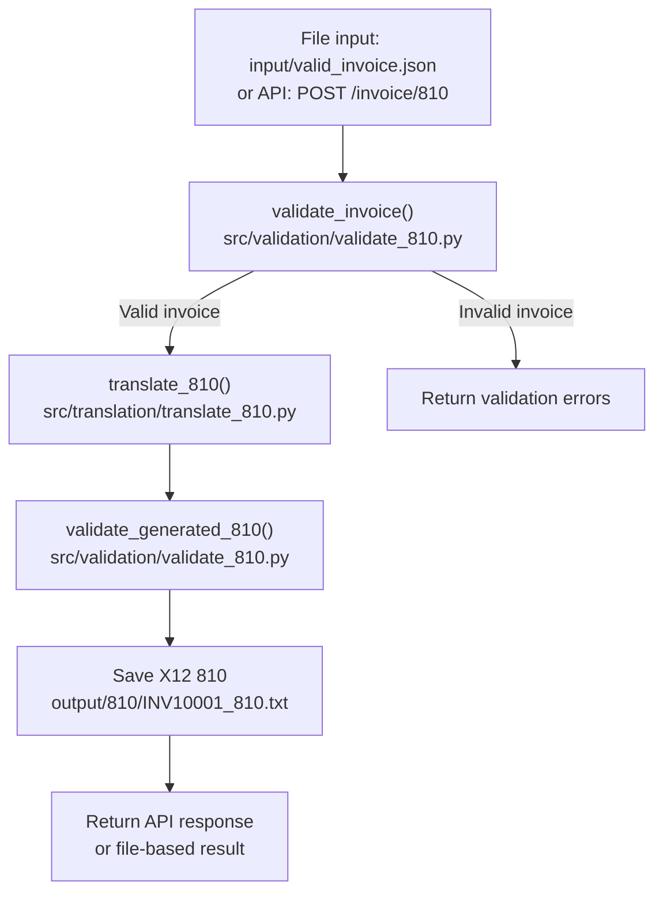

# edi-integration-pipeline

A small, deliberately plain Python project demonstrating two EDI workflows:

1. **Inbound X12 850** → validate envelope → validate transaction (compliance) → translate to JSON → generate 997
2. **Outbound invoice JSON** → validate → generate X12 810 → validate the generated EDI

Everything runs two ways — from files and from a FastAPI endpoint — using the
**same functions**. There is only one copy of the EDI logic.

The code uses only functions, dictionaries, lists, strings, loops and
conditionals. No classes, no dataclasses, no database, no third-party EDI
library. Readability is the point.

> **Build status:** This is a rebuild of the `v0.1-simple` baseline, adding an
> explicit envelope-validation layer and splitting validation/translation by
> transaction type. `validate_envelope.py`, `validation/validate_850.py`,
> `translation/translate_850.py`, `validation/validate_810.py`,
> `translation/translate_810.py`, and the HTTP status-code mapping in
> `main.py` are built and verified — **both the inbound 850 path and the
> outbound 810 path are now proven end to end, through both entry points
> (file-based and HTTP)**. Parsing responsibility lives entirely in
> `edi_parser.py` — `validate_envelope.py` no longer parses, it only checks
> already-parsed segments. `generate_997()` and `translate_810()` are both
> delimiter-aware and now emit a single unterminated stream (segments joined
> by their own `~` terminator only, no embedded `\n`) for compatibility with
> platforms that reject non-streamed EDI. The delimiter-threading fix is
> proven against a non-default-delimiter fixture (`+` in place of `*`), not
> just default fixtures. What was `edi_810.py`/`generate_810()` is now
> `translation/translate_810.py`/`translate_810()` — a real bug in
> `validate_810.py` (parsing the raw `parse_edi()` result object instead of
> unpacking `.segments`) was found and fixed in the process, which is what
> had made the outbound path look broken. See **Where this stands** below
> for the current line.

---

## Why an envelope layer

Real EDI platforms (Sterling, WTX) treat envelope integrity — ISA/GS/GE/IEA
structure, delimiter detection, control-number matching — as a distinct gate
that runs *before* any transaction-specific validation, because a broken
envelope means segment boundaries themselves can't be trusted. This project
mirrors that with a two-part split:

- **`edi_parser.py`** owns parsing outright, including `check_isa()`, which
  raises `EDIParseError` on a file too malformed to even split into segments
  (missing/short ISA, bad terminator). This is the true halt-tier case —
  nothing downstream ever sees a file that fails here.
- **`validate_envelope.py`** takes the already-parsed segment list and
  collects structural errors (missing GS/GE/IEA, bad GS04 date, mismatched
  control numbers, wrong group/transaction counts) into a list. It does not
  parse and does not raise — same collect-tier pattern as `validate_850()`.

`process_850()` in `main.py` is what turns a non-empty envelope-error list
into a pipeline halt: a distinct `"envelope_rejected"` status, short-circuits
before `validate_850()` ever runs, and produces no 997 (a 997 pulls its own
control numbers from the same interchange, so one can't safely be generated
when the envelope itself is unreliable — envelope-tier failures are reported
to the monitoring team, not acknowledged via 997).

This also drives the HTTP contract: envelope failure (`"envelope_rejected"`)
returns 400 from `post_850()` — the request itself was malformed, and there's
no 997 to return anyway. Transaction-tier rejection is not a 400 — a
correctly-formed 850 that fails business validation is a *successful* API
call that correctly reports an EDI business outcome, so it returns 200 with
the rejection recorded in the 997 body (AK5/AK9), not in the HTTP status.

## Why validation runs before translation, not after

`validate_850()` operates directly on the tokenized segment list — the same
list-of-lists shape `validate_envelope()` produces — not on translated JSON.
Translation happens only after a transaction passes compliance validation,
not before it. A transaction that fails compliance goes straight to a
negative 997 without ever needing a JSON representation, so building that
JSON earlier would be wasted work on the reject path. Parsing itself is not
a separate pipeline stage either — it's a sub-step inside `translate_850()`,
which parses and converts to JSON together in one function.

---

## Flow diagram

### Inbound 850 Purchase Order Workflow



### Outbound 810 Invoice Workflow



---

## Project structure

```
edi-integration-pipeline/
├── src/
│   ├── main.py                       FastAPI app + file-based examples + the two pipelines
│   ├── edi_parser.py                 delimiter detection, segment/element splitting,
│   │                                  segment lookup — parsing primitives only
│   ├── edi_exceptions.py             EDIParseError
│   ├── validate_envelope.py          envelope structural gate (ISA/GS/GE/IEA)
│   ├── validation/
│   │   ├── __init__.py
│   │   ├── validation_shared.py      shared primitives (is_number, is_positive_number)
│   │   ├── validate_850.py           compliance checks for inbound 850 (business-rule
│   │   │                              tier deferred — not yet built)
│   │   └── validate_810.py           checks for invoice JSON and generated 810
│   ├── translation/
│   │   ├── translation_shared.py     shared parse/convert primitives
│   │   ├── translate_850.py          850 segments -> purchase order JSON (parse + convert)
│   │   └── translate_810.py          invoice JSON -> 810 segments (built and verified;
│   │                                  formerly edi_810.py / generate_810())
│   └── edi_997.py                    generate_997()
├── input/                            sample inbound files
├── output/
│   ├── 997/                          generated X12 997 acknowledgments
│   ├── 850_json/                     JSON produced from inbound 850s
│   └── 810/                          generated X12 810 invoices
├── tests/test_edi.py                 pytest suite
├── requirements.txt
├── .gitignore
└── README.md
```

### What each Python file does

| File | Contents |
|---|---|
| `src/edi_parser.py` | Owns all parsing, including the halt-tier check. `check_isa()` (raises `EDIParseError` — moved here from `validate_envelope.py`, since parsing and halt-detection are one responsibility), `detect_delimiters()`, `split_segments()`, `parse_edi()` (calls `check_isa()` → `detect_delimiters()` → `split_segments()` → element-split, returns an `EDIParsingResult` with both `segments` and `delimiters`), `get_segment()`, `get_segments()`, `get_element()`, `build_segment()` (now takes a `delimiters` parameter — no more hardcoded `*`/`~` module constants), `pad_to_length()`, plus the file I/O helpers (`read_text_file()`, `write_text_file()`, `read_json_file()`, `write_json_file()`). |
| `src/edi_exceptions.py` | `EDIParseError` — raised for halt-tier parse failures (interchange too short/malformed to safely parse further). |
| `src/validate_envelope.py` | `validate_envelope()` — public orchestrator, built and verified. No longer parses — takes already-parsed segments and an implicit fresh `errors` list, pure collect-tier, same pattern as `validate_850()`. Private checks: `check_required_envelopes()`, `check_gs04()` (format check plus a calendar-validity check via `datetime.strptime` — a deliberate gap-fill feature, not standard compliance checking, since Sterling fails a bad GS04 date silently with no 997), `check_control_numbers()`, `check_group_count()`, `check_transaction_count()`. A non-empty result halts `process_850()` before `validate_850()` runs — see **Why an envelope layer** above. |
| `src/validation/validate_850.py` | `validate_850()` — public orchestrator, built and verified. Compliance-tier checks: `check_required_850_segments()` (ST/BEG/SE/PO1 presence), `check_required_850_header()` (ST01, BEG03/BEG05), `check_po1_required_elements()` (quantity/price presence **and** numeric format per line — `is_positive_number()` on PO102 quantity, `is_number()` on PO104 unit price, both bundled into this one check rather than split out separately), `check_po1_product_pairing()` (PO1 qualifier/ID pairs), `check_ref_pairing()` (REF01 present → REF02 required, unconditional), `check_segment_count()` (SE01 vs. actual segment count). Business-rule tier (price tolerance, vendor allowlist) not yet built. |
| `src/validation/validate_810.py` | `validate_invoice()` (required top-level fields, buyer/seller sections, per-line-item quantity/price/product-id checks) and `validate_generated_810()` (re-parses generated EDI, confirms required segments present, ST01 is `"810"`, SE01 segment count matches, CTT01 matches IT1 count) — both built and now tested clean against a real generated 810. **Bug fixed this session:** `validate_generated_810()` was calling `parse_edi(edi_text)` and handing the whole return object straight to `get_segment()`, instead of unpacking `.segments` first (the same pattern `process_850()` already used correctly). Every required-segment check failed identically as a result — not a partial failure, all ten at once — which is what made the outbound path look broken. One-line fix (`segments = parsed.segments`); the generated EDI itself had been correct the entire time. |
| `src/validation/validation_shared.py` | Primitives shared across 850/810 validation — `is_number()`, `is_positive_number()`, `has_value()`. `check_ref_pairing()` is intentionally *not* here yet — it lives in `validate_850.py` until `validate_810.py`'s REF usage is confirmed to need the same shape (not yet confirmed — `validate_invoice()` doesn't currently check REF pairing at all). |
| `src/translation/translate_850.py` | Built and verified — parses 850 segments and converts to purchase-order JSON (nested dict, `line_items` list) in one step, only for transactions that already passed `validate_850()`. Known open items: only the first PO1 qualifier/ID pair (PO106/107) is captured — a second pair (PO108/109) present in real fixtures is silently dropped; the N1 loop only recognizes `BY`/`SE` entity codes, so `ST` (ship-to) data is parsed then discarded. |
| `src/translation/translate_810.py` | `translate_810(invoice)` — converts invoice JSON to 810 segments (BIG, REF, N1 x2, IT1 per line, TDS via `calculate_invoice_total()`, CTT). **Renamed and relocated this session** from `edi_810.py`'s `generate_810()` — the JSON→EDI direction is genuine format translation (business data — line items, pricing, parties — crossing formats), the same category as `translate_850()`'s EDI→JSON direction, just reversed. `generate_997()` stayed a `generate_*` because it only assembles a protocol acknowledgment from control numbers and a pass/fail verdict — no business-data payload crosses a format boundary there. Built and verified end to end (file-based and HTTP) once the `validate_810.py` unpacking bug above was fixed. |
| `src/translation/translation_shared.py` | Primitives shared across 850/810 translation. Not yet built. |
| `src/edi_997.py` | `generate_997(segments, validation_errors, delimiters)` — builds ISA/GS/ST/AK1/AK2/AK5/AK9/SE/GE/IEA, accepted or rejected, wired to `validate_850()`'s output. Reads `len(validation_errors)` only — never inspects error type or content — so any check added to `validate_850()` in the future is automatically reflected here with no changes needed. Delimiter-aware (every `build_segment()` call passes through the inbound interchange's actual delimiters instead of hardcoded `*`/`~`), now **proven against a non-default-delimiter fixture** (`+` in place of `*`) in addition to default fixtures. Segments are joined with no separator (`"".join(edi_segments)`, changed from `"\n".join(...) + "\n"` this session) so the output is a single unterminated stream — some trading-partner platforms reject embedded newlines between segments. AK5/AK9 report transaction-level accept/reject only; no AK3/AK4 segment-level detail — a deliberate v1 scope cut, not an oversight. |
| `src/main.py` | `process_850()` — corrected order: `parse_edi()` → `validate_envelope()` → halt check (`"envelope_rejected"`, no 997, returns early) → `validate_850()` → `generate_997()` (delimiter-aware) → conditional `translate_850()`. `post_850()` maps `"envelope_rejected"` to `HTTPException(400, ...)`. `save_850_output()` and `run_850_file_example()` both guard against the `None` 997/purchase-order on the envelope-rejected path. `process_invoice()` calls `validate_invoice()` → `translate_810()` → `validate_generated_810()`, `save_810_output()`, the three API endpoints, and `run_file_examples()` round out the file. The two POST endpoints need no separate presence/trigger gating logic of their own — the route handler firing on an incoming request already is the trigger, since a POST to `/edi/850` or `/invoice/810` unambiguously means "process this." `run_file_examples()` remains a manual dev/test harness (fixture selection by commenting/uncommenting lines) — a known rough edge, not urgent enough to fix ahead of the deadline. |

### What `input/` contains

| File | Purpose |
|---|---|
| `valid_850.txt` | One buyer, one seller, two PO1 lines. Passes validation. |
| `invalid_850.txt` | BEG has no PO number and no PO date, and the PO1 quantity is `ABC`. Fails three ways. |
| `valid_invoice.json` | Two line items totalling 350.00. Passes validation. |
| `invalid_invoice.json` | No `invoice_number`, no `seller`, quantity `ABC`, blank `product_id`, negative price. Fails five ways. |

### What `output/` contains

| Folder | Written by | Example filename |
|---|---|---|
| `output/997/` | `save_850_output()` | `PO10001_997.txt`, `REJECTED_997.txt` |
| `output/850_json/` | `save_850_output()` (accepted only) | `PO10001.json` |
| `output/810/` | `save_810_output()` | `INV10001_810.txt` |

---

## Where this stands

Built and terminal-verified:

- `edi_parser.py`: `check_isa()`, `detect_delimiters()`, `split_segments()`, `parse_edi()` wired together correctly, plus `build_segment()` threading real delimiters instead of hardcoded constants — **now proven against a non-default-delimiter fixture (`+`), not just default (`*`/`~`) fixtures**
- `validate_envelope.py`: refactored to pure collect-tier — no longer parses, all five private checks plus the public `validate_envelope()` orchestrator
- `validation/validate_850.py`: all six compliance-tier checks plus the public `validate_850()` orchestrator, tested against a fixture with two planted breaks (empty REF02, mismatched SE01 count) — both caught correctly. The PO102/PO104 numeric-format check (quantity/price) is confirmed already built into `check_po1_required_elements()`, not a missing seventh check.
- `translation/translate_850.py`: parses + converts to purchase-order JSON, tested end to end against a real fixture via `main.py`'s file-based path
- `validation/validate_810.py`: `validate_invoice()` and `validate_generated_810()` both built — **and now confirmed working**, after fixing a bug where `validate_generated_810()` wasn't unpacking `parse_edi()`'s return object
- `translation/translate_810.py`: **new this session** — renamed/relocated from `edi_810.py`'s `generate_810()`. Builds a complete, correct 810 (ISA through IEA); tested end to end via both the file-based path and `POST /invoice/810`
- `edi_997.py`: `generate_997()` wired to `validate_850()`'s output (count-based only, confirmed no error-content inspection anywhere), delimiter-aware and now proven against non-default delimiters, streams output with no embedded newlines
- `main.py`'s `process_850()`: corrected order (parse → envelope validate → halt check → transaction validate → 997 → conditional translate), envelope-rejected path returns a distinct status with no 997, and `post_850()` maps that to HTTP 400 — **all three branches (envelope-rejected, transaction-rejected, accepted) proven via live HTTP requests this session, not just the file-based path**
- `main.py`'s `process_invoice()` / `POST /invoice/810`: proven via live HTTP request, matching the file-based output byte-for-byte in structure

Not yet built:

- Business-rule tier for the 850 (price tolerance, vendor allowlist — deliberately deferred, no ack equivalent)
- `translation/translation_shared.py`
- AK3/AK4 segment-level detail in the 997 — currently transaction-level accept/reject only (AK5/AK9); a named v1 scope cut, not an oversight

Known open questions, deliberately deferred rather than guessed at:

- `translate_850()`'s PO1 loop only captures the first qualifier/ID pair (PO106/107) — a confirmed second pair (PO108/109) in real fixture data is silently dropped; decision pending on single-pair-v1 vs. building the pairs list now
- `translate_850()`'s N1 loop only recognizes `BY`/`SE` entity codes — `ST` (ship-to) segments are parsed then discarded; not yet decided whether this is intentional v1 scope
- Symmetric PO1 qualifier/ID check — only qualifier-present/ID-missing is currently caught, not the reverse direction
- REF02 max length (30) and the PO1 qualifier-pair cap (three pairs: 06/07, 08/09, 10/11) — current best-known values from experience, not yet stated as fully confirmed maximums
- `check_segment_count()`'s `segments.index()` lookup is safe only because ST and SE are guaranteed unique per transaction set — revisit with `enumerate()` if this pattern is reused against a segment type that can legitimately repeat with identical content
- Missing segment terminator mid-file silently fusing two segments into one — identified during envelope work, still unfixed
- Whether `get_element()`'s silent `""` fallback on a missing element should instead be a checker-tier rejection
- Whether `check_ref_pairing()` generalizes cleanly to the 810 (REF segments are commonly echoed from PO to invoice, but this is an informed hypothesis, not a confirmed second consumer — `validate_invoice()` as built does not currently check REF pairing) — resolve once `translate_810.py`'s REF usage is reviewed against this, then extract to `validation_shared.py` if the shape actually matches

---

## Setup on macOS

Create the virtual environment (once):

```bash
cd ../python-projects/edi-integration-pipeline && python3 -m venv .venv
```

Activate it (every new terminal session):

```bash
cd ../python-projects/edi-integration-pipeline && source .venv/bin/activate
```

Your prompt now starts with `(.venv)`. Install the dependencies:

```bash
pip install -r requirements.txt
```

Leave the virtual environment later with `deactivate`.

---

## Run the file-based examples

This processes all four sample files and prints a full trace:

```bash
python src/main.py
```

## Start the API

```bash
uvicorn main:app --app-dir src --reload
```

`--app-dir src` puts `src/` on Python's import path, so `import edi_parser`
inside `main.py` works. `--reload` restarts the server when you edit a file.

Then open the interactive Swagger documentation in a browser:

```
http://127.0.0.1:8000/docs
```

Health check:

```bash
curl http://127.0.0.1:8000/health
```

Expected: `{"status":"ok"}`

**Stopping the server:** use `Ctrl+C` in the uvicorn terminal, never `Ctrl+C`'s
suspend-only cousin `Ctrl+Z`. `Ctrl+Z` freezes the process in the background
without releasing port 8000 — it looks stopped because the prompt returns,
but the port stays held, and the next `uvicorn ... --reload` fails with
`[Errno 48] Address already in use`, or worse, silently binds against a
half-alive process that accepts connections but never answers them. If a
port ever seems stuck, `lsof -i :8000` shows the PID actually holding it,
and `kill -9 <PID>` clears it before restarting.

## Submit the sample 850

From a second terminal, in the project folder:

```bash
curl -X POST http://127.0.0.1:8000/edi/850 -H "Content-Type: text/plain" --data-binary @input/valid_850.txt
```

The response contains `validation_status`, `validation_errors`,
`purchase_order`, `acknowledgment_997` and `saved_files`. Try the invalid one
to see the error messages:

```bash
curl -X POST http://127.0.0.1:8000/edi/850 -H "Content-Type: text/plain" --data-binary @input/invalid_850.txt
```

## Submit the invoice JSON

```bash
curl -X POST http://127.0.0.1:8000/invoice/810 -H "Content-Type: application/json" --data-binary @input/valid_invoice.json
```

```bash
curl -X POST http://127.0.0.1:8000/invoice/810 -H "Content-Type: application/json" --data-binary @input/invalid_invoice.json
```

## Inspect the generated files

```bash
find output -type f
```

```bash
cat output/997/PO10001_997.txt
```

```bash
cat output/850_json/PO10001.json
```

```bash
cat output/810/INV10001_810.txt
```

## Run the tests

```bash
pytest
```

---

## How an 850 moves through the Python functions

```
input/valid_850.txt              POST /edi/850
        |                              |
   read_text_file()              post_850()  (main.py)
        |                              |
        +--------------+---------------+
                       |
                process_850(raw_edi)           <- main.py, read this top to bottom
                       |
                parse_edi()                    <- edi_parser.py
                       |     raises EDIParseError (halt, ->400) if check_isa()
                       |     fails; otherwise returns segments + delimiters
                validate_envelope()            <- validate_envelope.py
                       |     collect-tier only, no parsing; non-empty result ->
                       |     "envelope_rejected", no 997, process_850() returns
                       |     early, post_850() raises HTTPException(400, ...)
                validate_850()                 <- validation/validate_850.py
                       |     returns [] or a list of readable compliance errors,
                       |     runs on the tokenized segments directly, no JSON yet
                generate_997()                 <- edi_997.py
                       |     accepted or rejected AK5/AK9, either way,
                       |     delimiter-aware (uses the inbound file's own
                       |     element separator / segment terminator)
                translate_850()                <- translation/translate_850.py
                       |     only runs if validate_850() passed;
                       |     text -> purchase order JSON (parse is a sub-step)
                save_850_output()              <- main.py
                       |
        output/997/PO10001_997.txt
        output/850_json/PO10001.json   (accepted only)
```

The API endpoint and the file example call exactly the same `process_850()`.
The only difference is where the EDI text came from.

## How an invoice moves through the Python functions

```
input/valid_invoice.json         POST /invoice/810
        |                              |
   read_json_file()              post_810()  (main.py)
        |                              |
        +--------------+---------------+
                       |
             process_invoice(invoice)          <- main.py
                       |
                validate_invoice()             <- validation/validate_810.py
                       |
                translate_810()                <- translation/translate_810.py
                       |     BIG, REF, N1 x2, IT1 per line,
                       |     TDS from calculate_invoice_total(),
                       |     CTT, then the SE segment count
                validate_generated_810()       <- validation/validate_810.py
                       |     re-parses the EDI it just built and
                       |     checks SE01 and CTT01 add up
                save_810_output()              <- main.py
                       |
        output/810/INV10001_810.txt
```

---

## Where to start reading

Start with **`src/main.py`**, specifically `process_850()`. It names every
other function in the project in the order they run. From there follow each
call into `validate_envelope.py`, `validation/validate_850.py`,
`translation/translate_850.py`, `edi_997.py`, and — for the outbound side —
`process_invoice()`, `validation/validate_810.py`, and
`translation/translate_810.py`.
