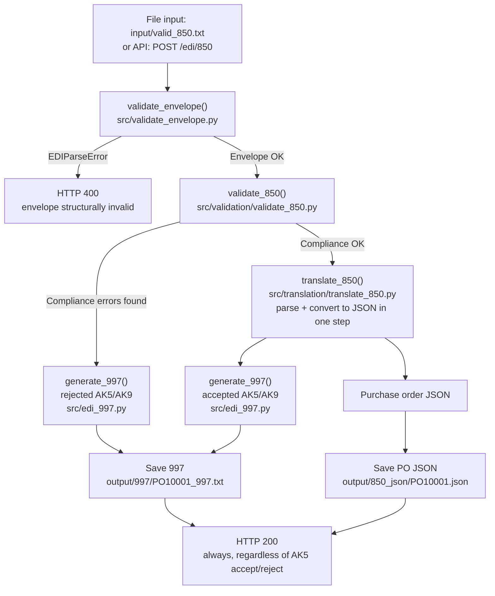
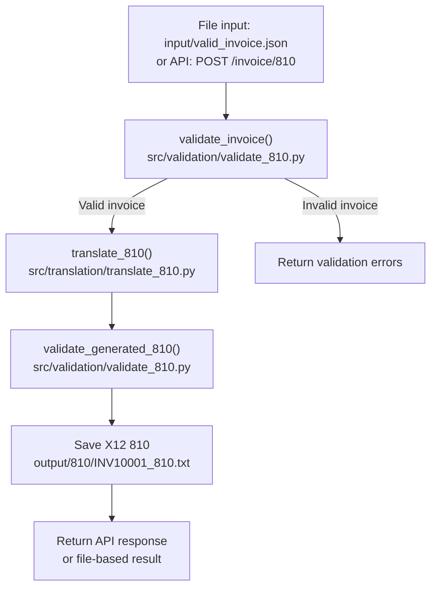

# edi-integration-pipeline

A small, deliberately plain Python project demonstrating two EDI workflows:

1. **Inbound X12 850** → validate envelope → validate transaction (compliance) → translate to JSON → generate 997
2. **Outbound invoice JSON** → validate → generate X12 810 → validate the generated EDI

Everything runs two ways — from files and from a FastAPI endpoint — using the
**same functions**. There is only one copy of the EDI logic.

The code uses only functions, dictionaries, lists, strings, loops and
conditionals. No classes, no dataclasses, no database, no third-party EDI
library. Readability is the point.

> **Build status:** This is a rebuild of the `v0.1-simple` baseline, adding an
> explicit envelope-validation layer and splitting validation/translation by
> transaction type. `validate_envelope.py` and `validation/validate_850.py`
> are built and verified. Translation (`translate_850.py`), the 810 path, and
> the HTTP status-code mapping are in progress. See **Where this stands**
> below for the current line.

---

## Why an envelope layer

Real EDI platforms (Sterling, WTX) treat envelope integrity — ISA/GS/GE/IEA
structure, delimiter detection, control-number matching — as a distinct gate
that runs *before* any transaction-specific validation, because a broken
envelope means segment boundaries themselves can't be trusted. This project
mirrors that: `validate_envelope()` runs first and can halt outright
(`EDIParseError`) on a file too malformed to even parse, or collect a list of
structural errors (missing segments, bad control numbers, mismatched counts)
that don't stop parsing but do fail the interchange. Only once the envelope
passes does transaction-tier validation (850/810 specific rules) run.

This also drives the HTTP contract: envelope failure is a client error (400)
— the request itself was malformed. Transaction-tier rejection is not — a
correctly-formed 850 that fails business validation is a *successful* API
call that correctly reports an EDI business outcome, so it returns 200 with
the rejection recorded in the 997 body (AK5/AK9), not in the HTTP status.

## Why validation runs before translation, not after

`validate_850()` operates directly on the tokenized segment list — the same
list-of-lists shape `validate_envelope()` produces — not on translated JSON.
Translation happens only after a transaction passes compliance validation,
not before it. A transaction that fails compliance goes straight to a
negative 997 without ever needing a JSON representation, so building that
JSON earlier would be wasted work on the reject path. Parsing itself is not
a separate pipeline stage either — it's a sub-step inside `translate_850()`,
which parses and converts to JSON together in one function.

---

## Flow diagram

### Inbound 850 Purchase Order Workflow



### Outbound 810 Invoice Workflow



---

## Project structure

```
edi-integration-pipeline/
├── src/
│   ├── main.py                       FastAPI app + file-based examples + the two pipelines
│   ├── edi_parser.py                 delimiter detection, segment/element splitting,
│   │                                  segment lookup — parsing primitives only
│   ├── edi_exceptions.py             EDIParseError
│   ├── validate_envelope.py          envelope structural gate (ISA/GS/GE/IEA)
│   ├── validation/
│   │   ├── __init__.py
│   │   ├── validation_shared.py      shared primitives (is_number, is_positive_number)
│   │   ├── validate_850.py           compliance checks for inbound 850 (business-rule
│   │   │                              tier deferred — not yet built)
│   │   └── validate_810.py           checks for invoice JSON and generated 810
│   ├── translation/
│   │   ├── translation_shared.py     shared parse/convert primitives
│   │   ├── translate_850.py          850 segments -> purchase order JSON (parse + convert)
│   │   └── translate_810.py          invoice JSON -> 810 segments
│   ├── edi_997.py                    generate_997()
│   └── edi_810.py                    generate_810() and the invoice total math
├── input/                            sample inbound files
├── output/
│   ├── 997/                          generated X12 997 acknowledgments
│   ├── 850_json/                     JSON produced from inbound 850s
│   └── 810/                          generated X12 810 invoices
├── tests/test_edi.py                 pytest suite
├── requirements.txt
├── .gitignore
└── README.md
```

### What each Python file does

| File | Contents |
|---|---|
| `src/edi_parser.py` | `read_text_file()`, `write_text_file()`, `read_json_file()`, `write_json_file()`, `detect_delimiters()`, `split_segments()`, `parse_edi()`, `get_segment()`, `get_segments()`, `get_element()`, `pad_to_length()`. Parsing-only — no transaction-specific translation logic lives here. |
| `src/edi_exceptions.py` | `EDIParseError` — raised for halt-tier parse failures (interchange too short/malformed to safely parse further). |
| `src/validate_envelope.py` | `validate_envelope()` — public orchestrator, built and verified. Private checks: `check_isa()` (halt-tier, raises `EDIParseError`), `check_required_envelopes()`, `check_gs04()` (format check plus a calendar-validity check via `datetime.strptime` — a deliberate gap-fill feature, not standard compliance checking, since Sterling fails a bad GS04 date silently with no 997), `check_control_numbers()`, `check_group_count()`, `check_transaction_count()` (collect-tier, share one `errors` list). |
| `src/validation/validate_850.py` | `validate_850()` — public orchestrator, built and verified. Compliance-tier checks: `check_required_850_segments()` (ST/BEG/SE/PO1 presence), `check_required_850_header()` (ST01, BEG03/BEG05), `check_po1_required_elements()` (quantity/price per line), `check_po1_product_pairing()` (PO1 qualifier/ID pairs), `check_ref_pairing()` (REF01 present → REF02 required, unconditional), `check_segment_count()` (SE01 vs. actual segment count). Business-rule tier (price tolerance, vendor allowlist) not yet built. |
| `src/validation/validate_810.py` | `validate_invoice()`, `validate_generated_810()`. Not yet built. |
| `src/validation/validation_shared.py` | Primitives shared across 850/810 validation — `is_number()`, `is_positive_number()`. `check_ref_pairing()` is intentionally *not* here yet — it lives in `validate_850.py` until `validate_810.py` is built and its REF usage is confirmed to need the same shape. |
| `src/translation/translate_850.py` | Parses 850 segments and converts to purchase-order JSON in one step, only for transactions that already passed `validate_850()` — parsing is a sub-step of translation, not a peer stage. Not yet built. |
| `src/translation/translate_810.py` | Converts invoice JSON to 810 segments. Not yet built. |
| `src/translation/translation_shared.py` | Primitives shared across 850/810 translation. Not yet built. |
| `src/edi_997.py` | `generate_997()` — builds ISA/GS/ST/AK1/AK2/AK5/AK9/SE/GE/IEA, accepted or rejected. Not yet wired to `validate_850()`'s output. |
| `src/edi_810.py` | `generate_810()`, `calculate_invoice_total()`, `calculate_line_amount()`, `make_control_number()`. |
| `src/main.py` | `process_850()`, `save_850_output()`, `process_invoice()`, `save_810_output()`, the three API endpoints, and `run_file_examples()`. Not yet updated for the validate-before-translate order. |

### What `input/` contains

| File | Purpose |
|---|---|
| `valid_850.txt` | One buyer, one seller, two PO1 lines. Passes validation. |
| `invalid_850.txt` | BEG has no PO number and no PO date, and the PO1 quantity is `ABC`. Fails three ways. |
| `valid_invoice.json` | Two line items totalling 350.00. Passes validation. |
| `invalid_invoice.json` | No `invoice_number`, no `seller`, quantity `ABC`, blank `product_id`, negative price. Fails five ways. |

### What `output/` contains

| Folder | Written by | Example filename |
|---|---|---|
| `output/997/` | `save_850_output()` | `PO10001_997.txt`, `REJECTED_997.txt` |
| `output/850_json/` | `save_850_output()` (accepted only) | `PO10001.json` |
| `output/810/` | `save_810_output()` | `INV10001_810.txt` |

---

## Where this stands

Built and terminal-verified:

- `edi_parser.py`: `detect_delimiters()`, `split_segments()`, `parse_edi()` wired together correctly
- `validate_envelope.py`: all six private checks plus the public `validate_envelope()` orchestrator
- `validation/validate_850.py`: all six compliance-tier checks plus the public `validate_850()` orchestrator, tested against a fixture with two planted breaks (empty REF02, mismatched SE01 count) — both caught correctly

Not yet built:

- Business-rule tier for the 850 (price tolerance, vendor allowlist — deliberately deferred, no ack equivalent)
- `translation/translate_850.py`, `translation/translation_shared.py` — parse + convert to JSON, runs only after `validate_850()` passes
- `validation/validate_810.py`, `translation/translate_810.py`
- Wiring `generate_997()` to `validate_850()`'s output (accepted vs. rejected AK5/AK9)
- HTTP status-code mapping in `main.py` (400 on envelope failure, 200 always on a processed request regardless of AK5 accept/reject, 500 only on genuine unhandled bugs)
- `main.py`'s `process_850()` updated to call `validate_850()` before `translate_850()`, matching the corrected flow diagram above

Known open questions, deliberately deferred rather than guessed at:

- Symmetric PO1 qualifier/ID check — only qualifier-present/ID-missing is currently caught, not the reverse direction
- REF02 max length (30) and the PO1 qualifier-pair cap (three pairs: 06/07, 08/09, 10/11) — current best-known values from experience, not yet stated as fully confirmed maximums
- `check_segment_count()`'s `segments.index()` lookup is safe only because ST and SE are guaranteed unique per transaction set — revisit with `enumerate()` if this pattern is reused against a segment type that can legitimately repeat with identical content
- Missing segment terminator mid-file silently fusing two segments into one — identified during envelope work, still unfixed
- Whether `get_element()`'s silent `""` fallback on a missing element should instead be a checker-tier rejection
- Whether `check_ref_pairing()` generalizes cleanly to the 810 (REF segments are commonly echoed from PO to invoice, but this is an informed hypothesis, not a confirmed second consumer) — resolve once `validate_810.py` is built, then extract to `validation_shared.py` if the shape actually matches

---

## Setup on macOS

Create the virtual environment (once):

```bash
cd ../python-projects/edi-integration-pipeline && python3 -m venv .venv
```

Activate it (every new terminal session):

```bash
cd ../python-projects/edi-integration-pipeline && source .venv/bin/activate
```

Your prompt now starts with `(.venv)`. Install the dependencies:

```bash
pip install -r requirements.txt
```

Leave the virtual environment later with `deactivate`.

---

## Run the file-based examples

This processes all four sample files and prints a full trace:

```bash
python src/main.py
```

## Start the API

```bash
uvicorn main:app --app-dir src --reload
```

`--app-dir src` puts `src/` on Python's import path, so `import edi_parser`
inside `main.py` works. `--reload` restarts the server when you edit a file.

Then open the interactive Swagger documentation in a browser:

```
http://127.0.0.1:8000/docs
```

Health check:

```bash
curl http://127.0.0.1:8000/health
```

Expected: `{"status":"ok"}`

## Submit the sample 850

From a second terminal, in the project folder:

```bash
curl -X POST http://127.0.0.1:8000/edi/850 -H "Content-Type: text/plain" --data-binary @input/valid_850.txt
```

The response contains `validation_status`, `validation_errors`,
`purchase_order`, `acknowledgment_997` and `saved_files`. Try the invalid one
to see the error messages:

```bash
curl -X POST http://127.0.0.1:8000/edi/850 -H "Content-Type: text/plain" --data-binary @input/invalid_850.txt
```

## Submit the invoice JSON

```bash
curl -X POST http://127.0.0.1:8000/invoice/810 -H "Content-Type: application/json" --data-binary @input/valid_invoice.json
```

```bash
curl -X POST http://127.0.0.1:8000/invoice/810 -H "Content-Type: application/json" --data-binary @input/invalid_invoice.json
```

## Inspect the generated files

```bash
find output -type f
```

```bash
cat output/997/PO10001_997.txt
```

```bash
cat output/850_json/PO10001.json
```

```bash
cat output/810/INV10001_810.txt
```

## Run the tests

```bash
pytest
```

---

## How an 850 moves through the Python functions

```
input/valid_850.txt              POST /edi/850
        |                              |
   read_text_file()              post_850()  (main.py)
        |                              |
        +--------------+---------------+
                       |
                process_850(edi_text)          <- main.py, read this top to bottom
                       |
                validate_envelope()            <- validate_envelope.py
                       |     raises EDIParseError (halt) or collects
                       |     structural errors -> 400 if any halt-tier failure
                validate_850()                 <- validation/validate_850.py
                       |     returns [] or a list of readable compliance errors,
                       |     runs on the tokenized segments directly, no JSON yet
                translate_850()                <- translation/translate_850.py
                       |     only runs if validate_850() passed;
                       |     text -> purchase order JSON (parse is a sub-step)
                generate_997()                 <- edi_997.py
                       |     accepted or rejected AK5/AK9, either way
                save_850_output()              <- main.py
                       |
        output/997/PO10001_997.txt
        output/850_json/PO10001.json   (accepted only)
```

The API endpoint and the file example call exactly the same `process_850()`.
The only difference is where the EDI text came from.

## How an invoice moves through the Python functions

```
input/valid_invoice.json         POST /invoice/810
        |                              |
   read_json_file()              post_810()  (main.py)
        |                              |
        +--------------+---------------+
                       |
             process_invoice(invoice)          <- main.py
                       |
                validate_invoice()             <- validation/validate_810.py
                       |
                translate_810()                <- translation/translate_810.py
                       |     BIG, REF, N1 x2, IT1 per line,
                       |     TDS from calculate_invoice_total(),
                       |     CTT, then the SE segment count
                validate_generated_810()       <- validation/validate_810.py
                       |     re-parses the EDI it just built and
                       |     checks SE01 and CTT01 add up
                save_810_output()              <- main.py
                       |
        output/810/INV10001_810.txt
```

---

## Where to start reading

Start with **`src/main.py`**, specifically `process_850()`. It names every
other function in the project in the order they run. From there follow each
call into `validate_envelope.py`, `validation/validate_850.py`,
`translation/`, `edi_997.py`, and `edi_810.py`.
