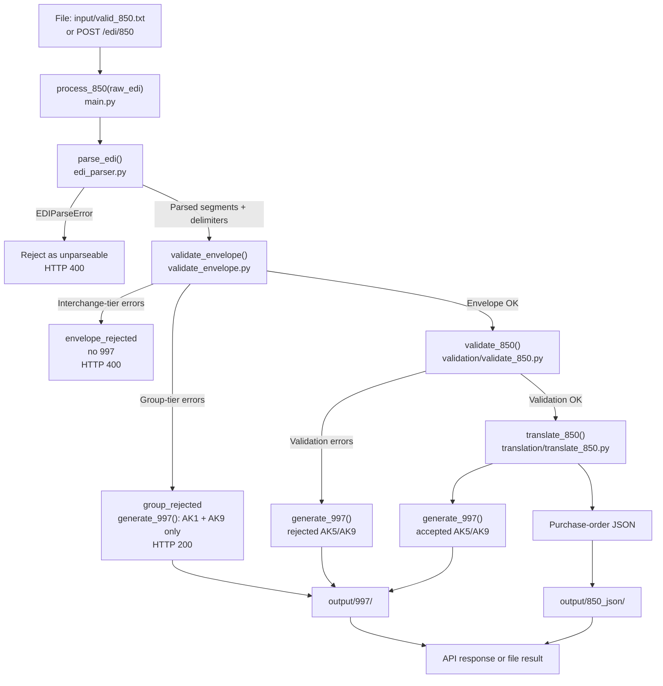
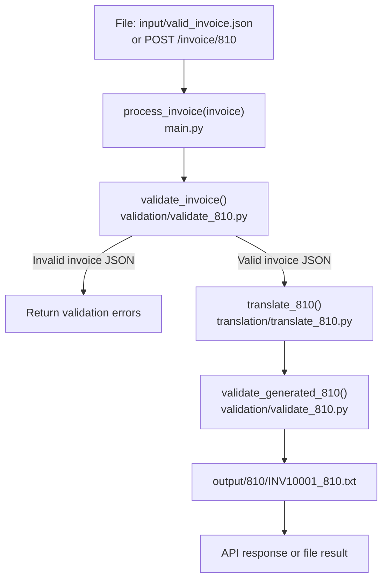

# Architecture and Execution Flow

Detailed technical reference for `edi-integration-pipeline`.

For the project purpose, setup instructions, usage commands, scope, and roadmap, see the main [`README.md`](../README.md).

---

## 1. System Overview

`edi-integration-pipeline` contains two EDI workflows:

1. **Inbound 850 workflow**  
   Accepts an X12 850 purchase order, validates the envelope, validates selected transaction rules, generates a 997 acknowledgment, and translates accepted transactions to purchase-order JSON.

2. **Outbound 810 workflow**  
   Accepts invoice JSON, validates the invoice payload, translates it to X12 810, then re-parses and validates the generated EDI before writing the output.

Both workflows are exposed through:

- File-based sample runs from `src/main.py`
- FastAPI endpoints from the same `src/main.py` module

The important design point: the file workflow and API workflow call the same processing functions. There is no separate copy of the business logic for CLI-style execution and HTTP execution.

---

## 2. Architecture Principles

### One processing path per workflow

The project avoids duplicated logic between file processing and API processing.

For inbound 850 processing:

```text
File input or HTTP request
        ↓
process_850(raw_edi)
        ↓
shared parser, validator, translator, and 997 generator
```

For outbound 810 processing:

```text
File input or HTTP request
        ↓
process_invoice(invoice)
        ↓
shared invoice validator, 810 translator, and generated-EDI validator
```

This makes behavior easier to test and easier to reason about.

---

### Envelope validation is separate from transaction validation

The project treats envelope structure as a separate gate before transaction-level validation.

That separation matters because the envelope controls whether the interchange is safe to parse and acknowledge. If the envelope is structurally unsafe, downstream transaction logic should not run.

The split is:

| Tier | Module | Behavior |
|---|---|---|
| Halt-tier parsing | `edi_parser.py` | Raises `EDIParseError` if the interchange cannot be safely split |
| Interchange-tier envelope validation | `validate_envelope.py` | Collects unacknowledgeable structural errors (ISA/IEA, missing GS) |
| Group-tier envelope validation | `validate_envelope.py` | Collects acknowledgeable structural errors (GS/GE control-number and count mismatches); only checked once interchange-tier passes |
| Transaction validation | `validation/validate_850.py` | Applies selected 850 compliance rules |
| Translation | `translation/translate_850.py` | Runs only after transaction validation passes |

---

### An interchange failure produces no 997

A 997 is a *functional* acknowledgment. Its scope begins at the functional
group: AK1 echoes the GS, AK2 echoes each ST, and AK5/AK9 report transaction
and group outcomes. It does not acknowledge the interchange envelope — that
is what a TA1 is for.

So when the ISA itself is invalid, a 997 is not just unhelpful, it is
unbuildable. The ISA carries the delimiters and the sender and receiver
identifiers. Without a trustworthy one there is no way to know which
characters to construct the acknowledgment from, or who to address it to.
Interchange-tier failures short-circuit with a distinct `envelope_rejected`
status and surface to monitoring rather than being acknowledged to the
partner.

TA1 generation is a named v1 scope cut, not an oversight of the tier.

---

### A group-tier failure produces a rejected 997

A group-tier envelope failure is a different case: the GS is present, but the GS/GE control numbers or the declared transaction count disagree. The functional group is still identifiable, so AK1 can still be built and the group can be acknowledged as rejected — the transaction inside it was simply never evaluated.

`generate_997()` builds AK1 and AK9 only for this case. The AK2/AK5 transaction-set loop is skipped entirely, since trusting individual transaction-set boundaries inside a group whose own envelope integrity already failed isn't reliable. AK9 reports the group as rejected and carries the specific AK905–AK909 error code(s) for whatever group-tier checks failed — more than one code is reported when more than one check fails.

This path returns `group_rejected` and HTTP 200: the interchange was still successfully processed and acknowledged, even though the acknowledgment itself is negative.

Reporting AK2/AK5 per transaction set inside a rejected group (finer-grained acknowledgment) is a named v2 scope cut, not an oversight.

---

### Business rejection is not the same as transport failure

The API distinguishes malformed requests from valid EDI business outcomes.

| Condition | HTTP Result | Reason |
|---|---|---|
| Unparseable interchange | **400** | The request itself is malformed |
| Envelope rejected — interchange-tier | **400** | The interchange structure is invalid, and no 997 can be built for an untrusted ISA |
| Envelope rejected — group-tier | **200** | The functional group is still identifiable and acknowledgeable; the API returns a rejected 997 |
| Transaction fails compliance validation | **200** | The API successfully processed the request and returns a rejected business outcome |
| Transaction accepted | **200** | The API successfully processed the request and returns an accepted business outcome |

This prevents retry logic from treating permanent business validation failures as temporary transport failures.

---

### Validation runs before translation

`validate_850()` operates on parsed EDI segments before `translate_850()` runs.

That means a rejected 850 does not need to be translated into JSON. The reject path is shorter and clearer:

```text
Parsed segments
   ↓
validate_850()
   ↓
validation errors found
   ↓
generate rejected 997
   ↓
no JSON translation
```

---

### Generated EDI is validated before output

For outbound invoices, the project does not simply build an 810 and trust it.

The generated EDI is re-parsed and checked by `validate_generated_810()` before it is written. This confirms that generated values such as `SE01` and `CTT01` match the transaction that was actually built.

---

### Delimiters are data, not constants

The inbound 850 flow detects delimiters from the ISA segment and passes them through the acknowledgment-generation process.

That allows the 997 to use the sender's delimiters instead of assuming hardcoded defaults like `*` and `~`.

---

## 3. Inbound 850 Flow



---

## 4. Inbound 850 Call Order

```text
input/valid_850.txt              POST /edi/850
        |                              |
   read_text_file()              post_850()
        +--------------+---------------+
                       |
                process_850(raw_edi)              <- main.py
                       |
                parse_edi()                       <- edi_parser.py
                       |   check_isa() raises EDIParseError if the ISA is too
                       |   malformed to identify delimiters and segment boundaries
                       |
                validate_envelope()               <- validate_envelope.py
                       |   collects interchange_errors and group_errors separately;
                       |   does not parse and does not raise
                       |
              if interchange_errors exist
                       |   return envelope_rejected; no 997; no 850 JSON; HTTP 400
                       |
              if group_errors exist (GS present, GS/GE checks failed)
                       |   generate_997()          <- edi_997.py, AK1 + AK9 only,
                       |                               AK905-AK909 error code(s)
                       |   return group_rejected; rejected 997; no 850 JSON; HTTP 200
                       |
                validate_850()                    <- validation/validate_850.py
                       |   validates selected transaction-level rules
                       |
                generate_997()                    <- edi_997.py
                       |   builds accepted or rejected AK5/AK9 result
                       |
              if validate_850() passed
                       |
                translate_850()                   <- translation/translate_850.py
                       |
                save_850_output()                 <- main.py
                       |
        output/997/PO10001_997.txt
        output/850_json/PO10001.json   accepted transactions only
```

---

## 5. Outbound 810 Flow



---

## 6. Outbound 810 Call Order

```text
input/valid_invoice.json         POST /invoice/810
        |                              |
   read_json_file()              post_810()
        +--------------+---------------+
                       |
             process_invoice(invoice)             <- main.py
                       |
                validate_invoice()                <- validation/validate_810.py
                       |   checks required invoice fields, parties, and line items
                       |
                translate_810()                   <- translation/translate_810.py
                       |   builds BIG, REF, N1, IT1, TDS, CTT, SE, GE, IEA
                       |
                validate_generated_810()          <- validation/validate_810.py
                       |   re-parses the generated EDI and checks the generated structure
                       |
                save_810_output()                 <- main.py
                       |
        output/810/INV10001_810.txt
```

---

## 7. Module Responsibilities

### `src/main.py`

Primary orchestration module.

Responsibilities:

- Defines the FastAPI application.
- Provides the `/edi/850` endpoint.
- Provides the `/invoice/810` endpoint.
- Runs file-based sample workflows.
- Coordinates inbound 850 processing through `process_850()`.
- Coordinates outbound invoice processing through `process_invoice()`.
- Writes successful sample outputs through helper save functions.

Important functions:

| Function | Role |
|---|---|
| `process_850()` | Runs the inbound 850 pipeline from raw EDI to 997 and optional JSON |
| `post_850()` | API route handler for inbound 850 processing |
| `save_850_output()` | Writes 997 and accepted purchase-order JSON output |
| `run_850_file_example()` | Runs a sample 850 file through the inbound pipeline |
| `process_invoice()` | Runs the outbound invoice-to-810 pipeline |
| `post_810()` | API route handler for invoice-to-810 processing |
| `save_810_output()` | Writes generated 810 output |

---

### `src/edi_parser.py`

Owns parsing, delimiter detection, segment construction, and file I/O.

Responsibilities:

- Confirm that an inbound interchange is safe enough to parse.
- Detect EDI delimiters from the ISA segment.
- Split EDI content into segments and elements.
- Provide segment lookup helpers.
- Build outbound segments using the correct delimiters.
- Read and write text and JSON files.

Important functions:

| Function | Role |
|---|---|
| `check_isa()` | Raises `EDIParseError` when an interchange is too short or malformed to split safely |
| `detect_delimiters()` | Reads element separator, segment terminator, and component separator from ISA |
| `split_segments()` | Splits EDI content using the detected segment terminator |
| `parse_edi()` | Runs ISA check, delimiter detection, segment splitting, and element splitting |
| `get_segment()` | Returns the first matching segment |
| `get_segments()` | Returns all matching segments |
| `get_element()` | Safely retrieves an element from a segment |
| `build_segment()` | Builds an EDI segment using the provided delimiters |
| `pad_to_length()` | Applies fixed-width padding used by ISA construction |
| `read_text_file()` | Reads text input |
| `write_text_file()` | Writes text output |
| `read_json_file()` | Reads JSON input |
| `write_json_file()` | Writes JSON output |

---

### `src/edi_exceptions.py`

Defines parser-specific exceptions.

| Item | Role |
|---|---|
| `EDIParseError` | Signals halt-tier parsing failures |

Use this exception only when the interchange is too malformed to parse safely.

---

### `src/validate_envelope.py`

Owns envelope-level structural validation after parsing succeeds, split by acknowledgment tier.

Responsibilities:

- Check required envelope segments, split by tier: GS/IEA presence is interchange-tier; GE presence is group-tier.
- Validate GS04 date format and calendar validity (interchange-tier).
- Validate ISA/IEA control-number consistency (interchange-tier).
- Validate declared interchange group count (interchange-tier).
- Validate GS/GE control-number consistency (group-tier).
- Validate declared transaction count (group-tier).
- Return two separate error lists instead of raising exceptions.

Important functions:

| Function | Role |
|---|---|
| `validate_envelope()` | Public orchestrator; runs interchange-tier checks first and short-circuits before any group-tier check if an interchange-tier error is found |
| `check_required_envelopes()` | Checks required GS/IEA presence (interchange-tier) |
| `check_gs04()` | Checks GS04 format and calendar validity (interchange-tier) |
| `check_interchange_control_numbers()` | Checks ISA13/IEA02 consistency (interchange-tier) |
| `check_interchange_group_count()` | Checks IEA01 against the actual GS count (interchange-tier) |
| `check_ge_present()` | Checks GE presence (group-tier) |
| `check_group_control_number()` | Checks GS06/GE02 consistency (group-tier) |
| `check_transaction_count()` | Checks GE01 against the actual ST count (group-tier) |

`validate_envelope()` returns an `EnvelopeValidationResult` with two fields: `interchange_errors: list[str]` and `group_errors: list[EDIError]`. ISA structural validity is checked earlier, in `edi_parser.py`, since delimiter extraction depends on it — this module assumes segments have already been successfully tokenized.

A non-empty `interchange_errors` halts the inbound 850 workflow before group-tier checks, transaction validation, and 997 generation. A non-empty `group_errors` (with `interchange_errors` empty) skips transaction validation and translation, but still reaches `generate_997()` for a rejected acknowledgment.

---

### `src/validation/validation_shared.py`

Contains small validation helpers and shared error types reused by validation modules.

| Item | Role |
|---|---|
| `has_value()` | Checks whether a value is present and not blank |
| `is_number()` | Checks whether a value can be treated as numeric |
| `is_positive_number()` | Checks whether a value is numeric and greater than zero |
| `EDIError` | Shared, tier-agnostic error container (`message`, `code`); used by group-tier envelope validation today, with transaction-tier validation slated to adopt it |
| `AK5Code` | Transaction Set Response Trailer error codes (AK502–AK506) |
| `AK905Code` | Functional Group Response Trailer error codes (AK905–AK909) |

`EDIError.code` is stored as a plain `int` rather than a stricter union type — both `AK5Code` and `AK905Code` are `IntEnum`, so the field stays tier-agnostic and callers like `generate_997()` never need to know which enum a code came from.

---

### `src/validation/validate_850.py`

Owns selected compliance validation for inbound X12 850 transactions.

Responsibilities:

- Confirm required 850 segments are present.
- Confirm required 850 header elements are populated.
- Validate required PO1 quantity and price fields.
- Validate numeric PO1 quantity and price fields.
- Validate PO1 product qualifier/product ID pairing.
- Validate REF qualifier/value pairing.
- Validate `SE01` against the actual segment count.

Important checks:

| Check | Rule |
|---|---|
| `check_required_850_segments()` | ST, BEG, SE, and PO1 must be present |
| `check_required_850_header()` | ST01, BEG03, and BEG05 must be present |
| `check_po1_required_elements()` | PO102 and PO104 must be present and numeric as required |
| `check_po1_product_pairing()` | PO1 product qualifiers must have corresponding product IDs |
| `check_ref_pairing()` | REF01 implies REF02 is required |
| `check_segment_count()` | SE01 must match the actual transaction segment count |

---

### `src/validation/validate_810.py`

Owns validation for invoice JSON input and generated X12 810 output.

Responsibilities:

- Validate required invoice header fields.
- Validate buyer and seller sections.
- Validate line-item quantity, price, and product ID fields.
- Re-parse generated 810 EDI.
- Confirm generated 810 required segments.
- Confirm generated `ST01` is `810`.
- Confirm generated `SE01` matches the actual segment count.
- Confirm generated `CTT01` matches the IT1 line count.

Important functions:

| Function | Role |
|---|---|
| `validate_invoice()` | Validates the invoice JSON before translation |
| `validate_generated_810()` | Validates the generated 810 after translation |

---

### `src/translation/translate_850.py`

Owns 850-to-JSON translation.

Responsibilities:

- Extract purchase-order header data.
- Extract control numbers.
- Extract buyer and seller parties.
- Extract references.
- Extract PO1 line items.
- Compute line-item extended amounts.
- Return a nested purchase-order dictionary.

This module runs only after `validate_850()` passes.

---

### `src/translation/translate_810.py`

Owns invoice JSON to X12 810 translation.

Responsibilities:

- Build invoice header segments.
- Build buyer and seller `N1` segments.
- Build one `IT1` segment per invoice line.
- Calculate invoice total for the `TDS` segment.
- Build `CTT` with the line-item count.
- Build `SE` with the generated segment count.
- Return generated 810 EDI.

Important functions:

| Function | Role |
|---|---|
| `translate_810()` | Converts invoice JSON to X12 810 EDI |
| `calculate_invoice_total()` | Calculates the invoice total from line quantities and prices |

---

### `src/edi_997.py`

Owns 997 acknowledgment generation.

Responsibilities:

- Build acknowledgment envelope segments.
- Build `AK1` from the acknowledged functional group.
- For a transaction-level result: build `AK2` and `AK5` for the acknowledged transaction set, plus `AK9`.
- For a group-tier rejection: skip `AK2`/`AK5` entirely, since no transaction set was evaluated, and build `AK9` with the relevant `AK905`–`AK909` error code(s), reporting expected vs. actual transaction-set counts.
- Use inbound delimiters when building the 997.
- Return a single EDI stream without embedded newlines.

Important function:

| Function | Role |
|---|---|
| `generate_997()` | Builds the functional acknowledgment for either a transaction-level result or a group-tier rejection |

`generate_997()` accepts an optional `group_errors` argument. When populated, it builds the group-tier shape (AK1 + AK9 only); otherwise it builds the transaction-tier shape (AK1 + AK2 + AK5 + AK9), driven by whether transaction-level validation errors exist. It reads the coded errors it's handed rather than inspecting every individual rule. This keeps the 997 generator separate from the individual validation rules.

---

## 8. Validation Strategy

The project uses layered validation.

```text
Raw EDI
   ↓
Halt-tier parser check
   ↓
Envelope validation
   ↓
Transaction validation
   ↓
Translation
   ↓
Generated-output validation where applicable
```

### Halt-tier parser check

Used when the file is too malformed to split safely.

Example result:

```text
EDIParseError
```

The pipeline stops immediately.

---

### Interchange-tier envelope validation

Used when the file can be parsed, but the interchange itself is unsafe or inconsistent — the functional group cannot be reliably identified or trusted.

Examples:

- Missing GS segment
- Missing IEA segment
- Invalid GS04 date
- Mismatched ISA/IEA control numbers
- Wrong declared interchange group count

The pipeline returns `envelope_rejected`. No 997 is generated.

---

### Group-tier envelope validation

Used when the interchange is sound and GS is present, but the functional group itself has a structural problem.

Examples:

- Missing GE segment
- Mismatched GS/GE control numbers
- Wrong declared transaction count

The pipeline returns `group_rejected` and generates a rejected 997 (AK1 + AK9 only — no AK2/AK5, since no individual transaction set was evaluated).

---

### Transaction validation

Used when the envelope is safe but the 850 itself fails selected compliance rules.

Examples:

- Missing BEG segment
- Missing BEG03 purchase-order number
- Missing BEG05 purchase-order date
- Invalid PO1 quantity
- Invalid PO1 price
- Incorrect SE01 segment count

The pipeline generates a rejected 997.

---

### Translation validation

Used after outbound 810 generation.

The generated EDI is re-parsed to verify that the output file itself is structurally consistent.

---

## 9. Error-Handling Behavior

| Failure point | Result | 997 generated? | JSON generated? | HTTP behavior |
|---|---|---:|---:|---:|
| `parse_edi()` raises `EDIParseError` | Unparseable interchange | No | No | 400 |
| `validate_envelope()` returns interchange-tier errors | `envelope_rejected` | No | No | 400 |
| `validate_envelope()` returns group-tier errors | `group_rejected` | Yes, rejected (AK1 + AK9 only) | No | 200 |
| `validate_850()` returns errors | Transaction rejected | Yes, rejected | No | 200 |
| `validate_850()` passes | Transaction accepted | Yes, accepted | Yes | 200 |
| `validate_invoice()` returns errors | Invoice rejected before translation | N/A | N/A | Validation response |
| `validate_generated_810()` returns errors | Generated EDI failed internal validation | N/A | N/A | Validation response |

---

## 10. Data Flow

### Inbound 850 data flow

```text
raw_edi: str
   ↓ parse_edi()
EDIParsingResult
   ├── segments: list[list[str]]
   └── delimiters: Delimiters
   ↓ validate_envelope()
EnvelopeValidationResult
   ├── interchange_errors: list[str]
   └── group_errors: list[EDIError]
   ↓ generate_997() only when group_errors is non-empty (AK1 + AK9 only)
   ↓ validate_850() only when both error lists are empty
transaction_errors: list[str]
   ↓ generate_997()
acknowledgment_997: str
   ↓ translate_850() only when valid
purchase_order: dict
```

### Outbound 810 data flow

```text
invoice: dict
   ↓ validate_invoice()
validation_errors: list[str]
   ↓ translate_810() only when valid
generated_810: str
   ↓ validate_generated_810()
generated_810_errors: list[str]
   ↓ save_810_output()
output file
```

---

## 11. Fixtures

### Input fixtures

| File | Purpose |
|---|---|
| `input/valid_850.txt` | Valid inbound 850 with one buyer, one seller, and two PO1 lines |
| `input/invalid_850.txt` | Invalid inbound 850 with missing BEG values and invalid PO1 quantity |
| `input/valid_invoice.json` | Valid invoice payload with two line items totalling 350.00 |
| `input/invalid_invoice.json` | Invalid invoice payload with missing and malformed fields |

### Output folders

| Folder | Written by | Contents |
|---|---|---|
| `output/997/` | `save_850_output()` | Generated 997 acknowledgments |
| `output/850_json/` | `save_850_output()` | Purchase-order JSON for accepted 850 transactions |
| `output/810/` | `save_810_output()` | Generated outbound 810 invoices |

---

## 12. Testing Strategy

The test suite should protect the behavior that matters most in production-shaped EDI processing:

- Parser rejects malformed interchanges early.
- Delimiters are detected correctly.
- Interchange-tier envelope validation catches control-number and count problems and halts with no 997.
- Group-tier envelope validation catches GS/GE control-number and count problems and generates a correctly-shaped rejected 997 (AK1 + AK9 only, correct AK905–AK909 codes).
- 850 validation catches required-field and numeric-field issues.
- Invalid 850 transactions generate rejected 997 acknowledgments.
- Valid 850 transactions generate accepted 997 acknowledgments and JSON.
- Invoice validation catches missing or malformed invoice data.
- Generated 810 files pass round-trip validation.

Run tests from the repository root:

```bash
pytest
```

---

## 13. Troubleshooting

### `[Errno 48] Address already in use`

This usually happens when Uvicorn was suspended instead of terminated.

Use `Ctrl+C` to stop Uvicorn. Do not use `Ctrl+Z`; that suspends the process and can leave port `8000` occupied.

To recover:

```bash
lsof -i :8000
kill -9 <PID>
```

Replace `<PID>` with the process ID returned by `lsof`.

---

## 14. Future Architecture Ideas

Potential next steps:

- Retrofit `validate_850()`'s checks to populate real `AK5Code` values via `EDIError`, so transaction-tier AK5 reflects the specific rule that failed instead of a fixed code.
- Add AK3 and AK4 detail to rejected 997 acknowledgments.
- Add batch-folder processing.
- Add structured logging.
- Add partner-specific validation rules.
- Add persistence for transaction audit history.
- Add warehouse landing tables for accepted purchase orders and invoices.
- Add dbt models for downstream analytics.
