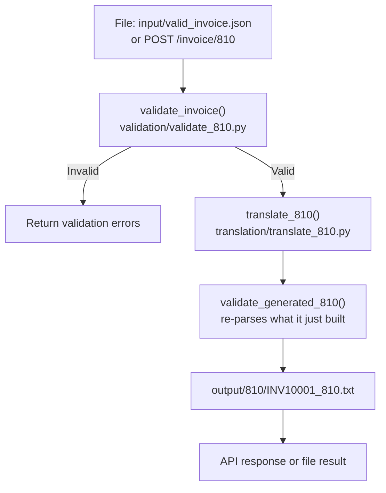

# Architecture

Detailed reference for `edi-integration-pipeline`. For the overview, design
rationale and sample input/output, see the [README](../README.md).

---

## Outbound 810 flow



## Call order — inbound 850

```
input/valid_850.txt              POST /edi/850
        |                              |
   read_text_file()              post_850()
        +--------------+---------------+
                       |
                process_850(raw_edi)              <- main.py
                       |
                parse_edi()                       <- edi_parser.py
                       |   raises EDIParseError (halt -> 400) if check_isa()
                       |   fails; otherwise returns segments + delimiters
                validate_envelope()               <- validate_envelope.py
                       |   collect-tier only; non-empty result ->
                       |   "envelope_rejected", no 997, early return, HTTP 400
                validate_850()                    <- validation/validate_850.py
                       |   runs on tokenized segments, no JSON yet
                generate_997()                    <- edi_997.py
                       |   accepted or rejected AK5/AK9, delimiter-aware
                translate_850()                   <- translation/translate_850.py
                       |   only if validate_850() passed
                save_850_output()                 <- main.py
                       |
        output/997/PO10001_997.txt
        output/850_json/PO10001.json   (accepted only)
```

## Call order — outbound invoice

```
input/valid_invoice.json         POST /invoice/810
        |                              |
   read_json_file()              post_810()
        +--------------+---------------+
                       |
             process_invoice(invoice)             <- main.py
                       |
                validate_invoice()                <- validation/validate_810.py
                translate_810()                   <- translation/translate_810.py
                       |   BIG, REF, N1 x2, IT1 per line, TDS from
                       |   calculate_invoice_total(), CTT, then SE count
                validate_generated_810()          <- validation/validate_810.py
                       |   re-parses the EDI it just built, checks SE01/CTT01
                save_810_output()                 <- main.py
                       |
        output/810/INV10001_810.txt
```

---

## Module reference

### `src/edi_parser.py`

Owns all parsing, including halt-tier detection.

| Function | Role |
|---|---|
| `check_isa()` | Raises `EDIParseError` when the interchange is too short or malformed to split safely |
| `detect_delimiters()` | Reads element separator, segment terminator and component separator from the ISA |
| `split_segments()` | Splits on the detected terminator |
| `parse_edi()` | `check_isa()` → `detect_delimiters()` → `split_segments()` → element split; returns `EDIParsingResult` carrying both `segments` and `delimiters` |
| `get_segment()` / `get_segments()` / `get_element()` | Lookup primitives |
| `build_segment()` | Takes a `delimiters` parameter — no hardcoded `*`/`~` module constants |
| `pad_to_length()` | ISA fixed-width padding |
| `read_text_file()` / `write_text_file()` / `read_json_file()` / `write_json_file()` | File I/O |

### `src/edi_exceptions.py`

`EDIParseError` — halt tier only.

### `src/validate_envelope.py`

`validate_envelope()` is the public orchestrator. Pure collect-tier: it takes
already-parsed segments, returns a list, and never raises.

Private checks: `check_required_envelopes()`, `check_gs04()` (format plus
calendar validity via `datetime.strptime`), `check_control_numbers()`,
`check_group_count()`, `check_transaction_count()`.

A non-empty result halts `process_850()` before `validate_850()` runs.

### `src/validation/validate_850.py`

`validate_850()` orchestrates six compliance-tier checks:

- `check_required_850_segments()` — ST/BEG/SE/PO1 presence
- `check_required_850_header()` — ST01, BEG03, BEG05
- `check_po1_required_elements()` — quantity/price presence **and** numeric
  format per line (`is_positive_number()` on PO102, `is_number()` on PO104)
- `check_po1_product_pairing()` — PO1 qualifier/ID pairs
- `check_ref_pairing()` — REF01 present implies REF02 required
- `check_segment_count()` — SE01 against the actual segment count

### `src/validation/validate_810.py`

`validate_invoice()` — required top-level fields, buyer/seller sections,
per-line quantity/price/product-id checks.

`validate_generated_810()` — re-parses the generated interchange, confirms
required segments are present, `ST01` is `810`, `SE01` matches the segment
count and `CTT01` matches the IT1 count.

### `src/validation/validation_shared.py`

`is_number()`, `is_positive_number()`, `has_value()`.

`check_ref_pairing()` deliberately lives in `validate_850.py` rather than
here — it has one confirmed consumer, and extraction waits on a second.

### `src/translation/translate_850.py`

Parses 850 segments and converts to purchase-order JSON (nested dict with a
`line_items` list) in one step, only for transactions that already passed
`validate_850()`.

### `src/translation/translate_810.py`

`translate_810(invoice)` — converts invoice JSON to 810 segments: BIG, REF,
N1 ×2, IT1 per line, TDS via `calculate_invoice_total()`, CTT, SE.

Named `translate_*` rather than `generate_*` because business data — line
items, pricing, parties — crosses a format boundary, the same category as
`translate_850()` in reverse. `generate_997()` keeps the `generate_` prefix
because it assembles a protocol acknowledgment from control numbers and a
pass/fail verdict; no business payload crosses formats there.

### `src/edi_997.py`

`generate_997(segments, validation_errors, delimiters)` builds
ISA/GS/ST/AK1/AK2/AK5/AK9/SE/GE/IEA.

It reads `len(validation_errors)` only and never inspects error type or
content, so any check added to `validate_850()` is reflected automatically
with no changes here.

Every `build_segment()` call receives the inbound interchange's actual
delimiters. Segments are joined with no separator, producing a single
unterminated stream — some trading-partner platforms reject embedded
newlines between segments.

### `src/main.py`

`process_850()` — `parse_edi()` → `validate_envelope()` → halt check →
`validate_850()` → `generate_997()` → conditional `translate_850()`.

`post_850()` maps `envelope_rejected` to `HTTPException(400, ...)`.
`save_850_output()` and `run_850_file_example()` both guard against the
`None` 997 and purchase order on the envelope-rejected path.

`process_invoice()` — `validate_invoice()` → `translate_810()` →
`validate_generated_810()`, then `save_810_output()`.

The two POST endpoints need no separate trigger gating: the route handler
firing on an incoming request *is* the trigger.

---

## Fixtures

| File | Purpose |
|---|---|
| `input/valid_850.txt` | One buyer, one seller, two PO1 lines. Passes. |
| `input/invalid_850.txt` | BEG missing PO number and PO date; PO1 quantity is `ABC`. Fails three ways. |
| `input/valid_invoice.json` | Two line items totalling 350.00. Passes. |
| `input/invalid_invoice.json` | No `invoice_number`, no `seller`, quantity `ABC`, blank `product_id`, negative price. Fails five ways. |

| Output folder | Written by | Example |
|---|---|---|
| `output/997/` | `save_850_output()` | `PO10001_997.txt`, `REJECTED_997.txt` |
| `output/850_json/` | `save_850_output()` (accepted only) | `PO10001.json` |
| `output/810/` | `save_810_output()` | `INV10001_810.txt` |

---

## Troubleshooting

**`[Errno 48] Address already in use` after stopping the server.** Stop
uvicorn with `Ctrl+C`, not `Ctrl+Z`. `Ctrl+Z` suspends the process rather
than terminating it: the prompt returns, but port 8000 stays held. Recover
with `lsof -i :8000` to find the PID, then `kill -9 <PID>`.
